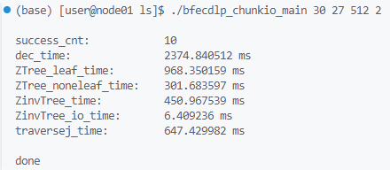
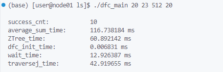

# BFECDLP
**Blazing Fast EC-based Additively Homomorphic Decryption via Pipeline with CPU+GPU Acceleration and Applications.**

## Prequisites
- C++17
- OpenCL 3.0
- CUDA version 12.4+

## Build

The main code is located in `bfecdlp_chunkio_main.cpp`, which constructs the Montegomery Tree in a breadth-first approach, with an optional depth-first implemention available in `dfc_main.cpp`.

Build the `cpp` code with following command:

```shell
g++ bfecdlp_chunkio_main.cpp threadpool.cpp utils.cpp -o bfecdlp_chunkio_main -I/usr/local/cuda/include -L/usr/local/cuda/lib64 -lOpenCL -O3 -fpermissive -pthread
```

```shell
g++ dfc_main.cpp threadpool.cpp utils.cpp -o dfc_main -I/usr/local/cuda/include -L/usr/local/cuda/lib64 -lOpenCL -O3 -fpermissive -pthread
```

## Run

### ` bfecdlp_chunkio_main.cpp`

Eg:

```shell
./bfecdlp_chunkio_main 30 27 512 2
```

[30, 27, 512, 2]->[ $\ell_1-1$, $\ell_2-1$, `t2_num`, `length` ]

`t2_num` denotes the number of chunks of $\mathbf{T}_2$ to be split. `length` denotes the maximum length of shared queue $\mathcal{Q}$ which stores the chunks. 

If you want to run the BFECDLP without splitting $\mathbf{T}_2$ into chunks, make `t2_num = 1` and `length = 1`.

### `dfc_main.cpp`

Eg:

```shell
./dfc_main 20 23 512 20
```

[20, 23, 512, 20]->[ $\ell_1-1$, $\ell_2-1$, `tree_block_num`, `pre_num` ]

`tree_block_num` denotes the number of blocks of $\mathbf{Z}^\prime$, i.e., the number of subtrees of $\mathbf{BT}_2$. `pre_num` denotes the number of initial blocks before decryption. 

## Result example





